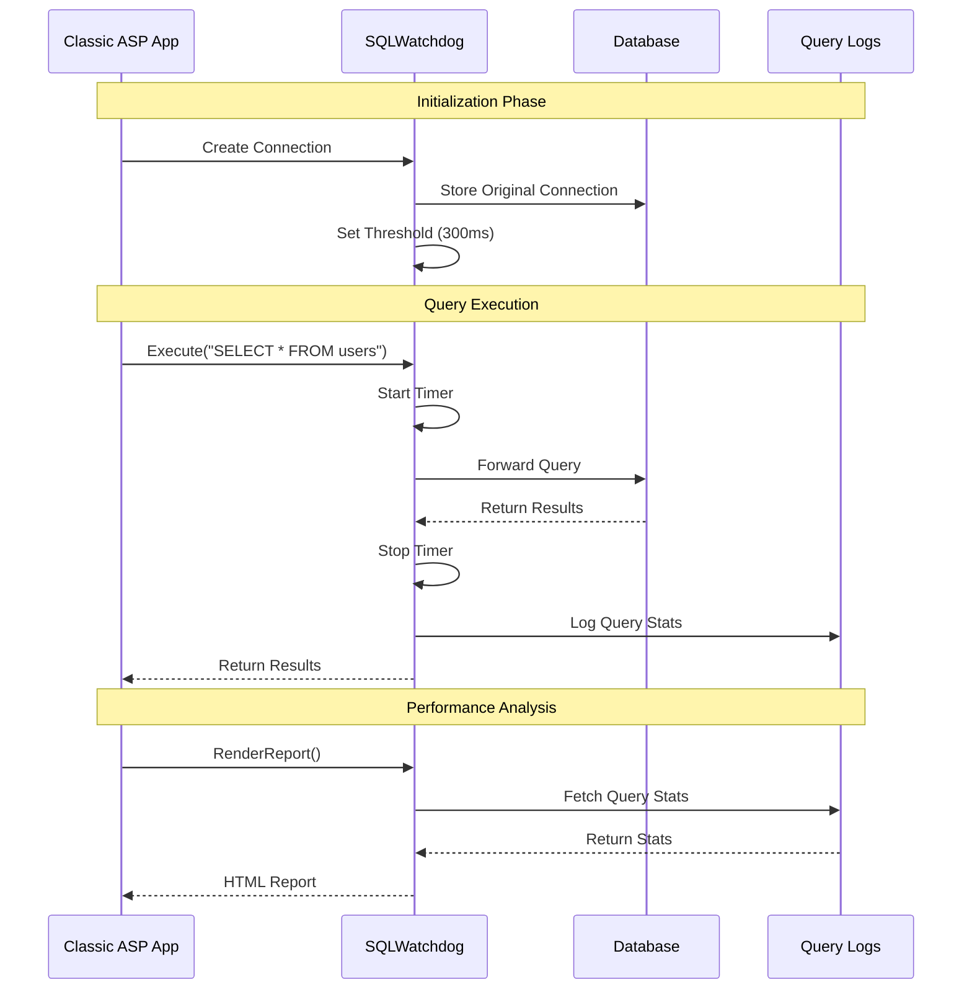
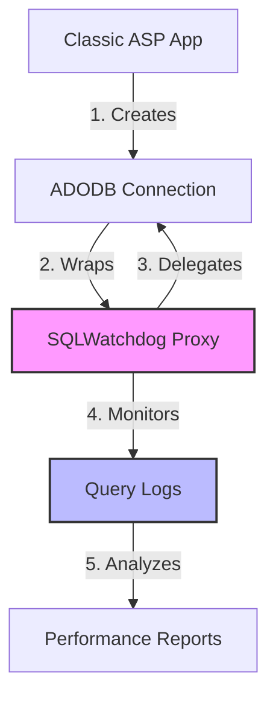

# Classic ASP SQLWatchdog

A lightweight SQL query performance monitoring and profiling tool designed specifically for Classic ASP applications. SQLWatchdog helps developers identify slow queries, monitor SQL performance, and optimize database operations with minimal setup and overhead.

## How It Works



## Architecture



## Features

- 🔍 **Zero-Configuration Monitoring**: Simply wrap your existing connection with SQLWatchdog
- ⚡ **Performance Tracking**: Automatically tracks query execution times
- 🎯 **Slow Query Detection**: Configurable threshold for identifying slow queries
- 📊 **Query Analysis**: Detailed reports on query types and execution times
- 🛡️ **Safe Connection Handling**: Proper connection lifecycle management
- 🔄 **Transaction Support**: Full support for database transactions

## Quick Start

1. Include the SQLWatchdog in your ASP page:
```asp
<!-- #include file="sqlwatchdog.asp" -->
```

2. Initialize SQLWatchdog with your existing connection:
```asp
' Create normal connection
Dim Conn, origConn
Set Conn = Server.CreateObject("ADODB.Connection")
    Conn.Open connectionString

' Replace with SQLWatchdog
Set origConn = Conn                 ' Keep reference to original connection
Set Conn = New SQLWatchdog          ' Create proxy
    Conn.SetConnection origConn     ' Give original connection to proxy
    Conn.SetThreshold 0.3           ' Set slow query threshold (300ms)
```

3. Use normally - SQLWatchdog automatically monitors all queries:
```asp
Set rs = Conn.Execute("SELECT * FROM users")
' ... use recordset as normal ...
```

## Core Concepts

### Proxy Pattern Implementation

SQLWatchdog uses the Proxy design pattern to intercept and monitor database operations without requiring changes to your existing code. Here's how it works:

1. **Connection Wrapping**: 
   - Original connection is stored safely in the proxy
   - All operations are delegated to the original connection
   - Performance metrics are collected during delegation

2. **Reference Management**:
   - Original connection reference is preserved
   - Proxy maintains its own state without affecting original connection
   - Proper cleanup on termination

3. **Query Monitoring**:
   - Each query execution is timed
   - Query type is analyzed (SELECT, INSERT, UPDATE, DELETE)
   - Performance metrics are stored in memory

## API Reference

### Core Methods

#### `SetConnection(connection)`
Associates the SQLWatchdog with an existing database connection.
```asp
Conn.SetConnection origConn
```

#### `SetThreshold(seconds)`
Sets the threshold for slow query detection in seconds.
```asp
Conn.SetThreshold 0.3  ' 300ms
```

#### `Execute(sqlQuery)`
Executes a SQL query with performance monitoring.
```asp
Set rs = Conn.Execute("SELECT * FROM users")
```

#### `ExecuteParams(sqlQuery, params)`
Executes a parameterized query safely.
```asp
Set rs = Conn.ExecuteParams("SELECT * FROM users WHERE id = ?", Array(userId))
```

### Transaction Methods

- `BeginTrans()`: Starts a transaction
- `CommitTrans()`: Commits current transaction
- `RollbackTrans()`: Rolls back current transaction

### Reporting Methods

#### `GetLastError()`
Returns the last error message if any.
```asp
If rs Is Nothing Then
    Response.Write Conn.GetLastError()
End If
```

#### `ClearLogs()`
Clears the query log history.
```asp
Conn.ClearLogs()
```

#### `RenderReport(showAll)`
Generates an HTML report of query performance.
```asp
Response.Write Conn.RenderReport(True)  ' Show all queries
```

## Best Practices

1. **Always Keep Original Connection Reference**
```asp
' GOOD
Set origConn = Conn
Set Conn = New SQLWatchdog
    Conn.SetConnection origConn

' BAD - Original connection lost
Set Conn = New SQLWatchdog
    Conn.SetConnection Conn  ' Don't do this!
```

2. **Proper Cleanup**
```asp
' Clean up in reverse order
Conn.ClearLogs()
Conn.Close
Set Conn = Nothing
```

3. **Error Handling**
```asp
Set rs = Conn.Execute(sql)
If rs Is Nothing Then
    ' Handle error
    Response.Write "<p class='error'>" & Conn.GetLastError() & "</p>"
End If
```

## License

MIT License - see LICENSE file for details.

## Author

Anthony Burak DURSUN
- Email: badursun@gmail.com
- GitHub: [badursun](https://github.com/badursun)

---
**Note**: This tool is designed for development and debugging purposes. Consider your production environment's requirements before enabling in production.
