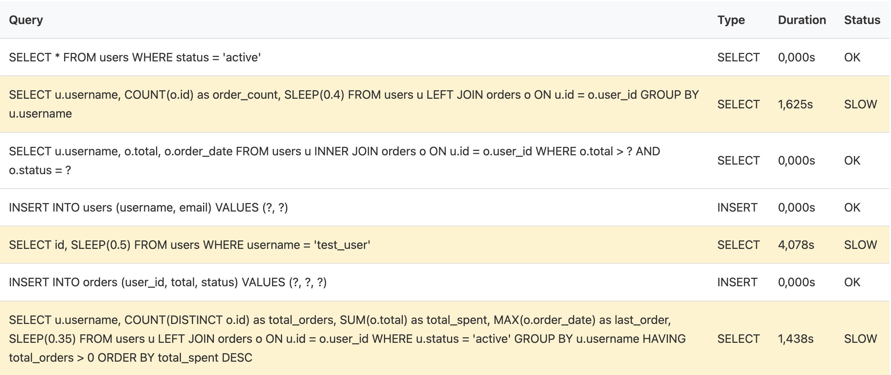
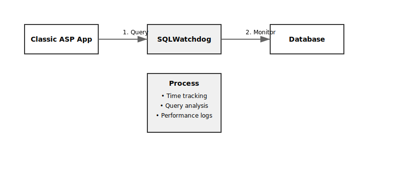
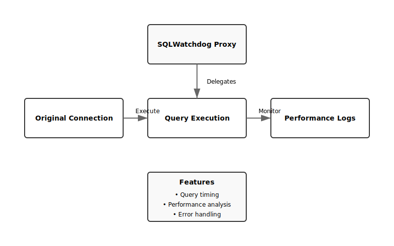

# Classic ASP SQLWatchdog


A lightweight SQL query performance monitoring and profiling tool designed specifically for Classic ASP applications. SQLWatchdog helps developers identify slow queries, monitor SQL performance, and optimize database operations with minimal setup and overhead.

## Features

- 🔍 **Zero-Configuration Monitoring**: Simply wrap your existing connection with SQLWatchdog
- ⚡ **Performance Tracking**: Automatically tracks query execution times
- 🎯 **Slow Query Detection**: Configurable threshold for identifying slow queries (default: 500ms)
- 📊 **Query Analysis**: Detailed reports on query types (SELECT, INSERT, UPDATE, DELETE)
- 🛡️ **Safe Connection Handling**: Proper connection lifecycle management
- 🔄 **Transaction Support**: Full support for database transactions
- 📝 **Query Logging**: Comprehensive logging of all SQL operations
- 🎨 **Built-in HTML Reports**: Beautiful, styled performance reports
- ⚠️ **Error Handling**: Detailed SQL error capturing and reporting
- 🔒 **Parameter Safety**: Automatic parameter type detection and safe handling

### Sample Performance Report


The built-in performance report shows:
- Query content with syntax highlighting
- Query type (SELECT, INSERT, etc.)
- Execution duration in seconds
- Status indicators (SLOW/OK)
- Highlighted slow queries for easy identification

## Quick Start

1. Include the SQLWatchdog in your ASP page:
```asp
<!-- #include file="sqlwatchdog.asp" -->
```

2. Initialize SQLWatchdog with your existing connection:
```asp
' Create normal connection
Dim Conn, origConn
Set Conn = Server.CreateObject("ADODB.Connection")
    Conn.Open connectionString

' Replace with SQLWatchdog
Set origConn = Conn                 ' Keep reference to original connection
Set Conn = New SQLWatchdog          ' Create proxy
    Conn.SetConnection origConn     ' Give original connection to proxy
    Conn.SetThreshold 0.3           ' Set slow query threshold (300ms)
```

3. Use normally - SQLWatchdog automatically monitors all queries:
```asp
Set rs = Conn.Execute("SELECT * FROM users")
' ... use recordset as normal ...
```

## How It Works

### Workflow


The diagram above shows how SQLWatchdog intercepts and monitors database operations:
1. Your ASP application sends a query
2. SQLWatchdog intercepts and starts timing
3. Query is forwarded to the database
4. Results are captured and analyzed
5. Performance metrics are logged

### Architecture


The architecture diagram illustrates:
1. SQLWatchdog acts as a proxy between your app and database
2. Original connection is preserved and delegated to
3. All queries are monitored and timed
4. Performance data is collected and analyzed
5. Reports are generated on demand

## API Reference

### Core Methods

#### `SetConnection(connection)`
Associates the SQLWatchdog with an existing database connection.
```asp
Conn.SetConnection origConn
```

#### `SetThreshold(seconds)`
Sets the threshold for slow query detection in seconds.
```asp
Conn.SetThreshold 0.3  ' 300ms
```

#### `Execute(sqlQuery)`
Executes a SQL query with performance monitoring.
```asp
Set rs = Conn.Execute("SELECT * FROM users")
```

#### `ExecuteParams(sqlQuery, params)`
Executes a parameterized query safely.
```asp
Set rs = Conn.ExecuteParams("SELECT * FROM users WHERE id = ?", Array(userId))
```

### Helper Methods

#### `GetQueryType(sqlQuery)`
Internally determines the type of SQL query:
- SELECT
- INSERT
- UPDATE
- DELETE
- OTHER

#### `GetParamType(value)`
Automatically detects parameter types:
- Integer (vbInteger, vbLong)
- Double (vbSingle, vbDouble)
- Date (vbDate)
- String (vbString)
- Boolean (vbBoolean)
- Default: VarChar

### Connection Methods

#### `State`
Get the current connection state.
```asp
If Conn.State = 1 Then ' adStateOpen
    ' Connection is open
End If
```

#### `Close()`
Safely closes the database connection.
```asp
Conn.Close
```

### Transaction Methods

- `BeginTrans()`: Starts a transaction
- `CommitTrans()`: Commits current transaction
- `RollbackTrans()`: Rolls back current transaction

### Reporting Methods

#### `GetLastError()`
Returns the last error message if any.
```asp
If rs Is Nothing Then
    Response.Write Conn.GetLastError()
End If
```

#### `ClearLogs()`
Clears the query log history.
```asp
Conn.ClearLogs()
```

#### `RenderReport(showAll)`
Generates an HTML report of query performance.
```asp
Response.Write Conn.RenderReport(True)  ' Show all queries
```

### HTML Report Styling

The `RenderReport` method includes built-in CSS styling:
- Clean table layout
- Highlighted slow queries
- Color-coded status indicators
- Responsive design
- Modern typography

Example Report Columns:
- Query content (HTML encoded for safety)
- Query type
- Duration (in seconds)
- Status (SLOW/OK)

## Testing & Examples

The `example` directory contains everything you need to test SQLWatchdog:

### 1. Configure Database Connection
Edit `example/db.asp` with your database settings:
```asp
Const DBdriver = "MySQL ODBC 3.51 Driver"
Dim DBname : DBname     = "demo_test_db"
Dim DBuser : DBuser     = "demo_test_user"
Dim DBpass : DBpass     = "your_password"
Dim DBserver : DBserver = "localhost"
Dim DBPort : DBPort     = "3306"
```

### 2. Create Test Database
Run `example/createtestdb.asp` to set up the test environment:
- Creates test database if not exists
- Sets up `users` and `orders` tables
- Populates tables with sample data

Tables Created:
- `users` (id, username, email, created_at, status)
- `orders` (id, user_id, total, order_date, status)

### 3. Run Example Queries
Access `example/usage.asp` to see SQLWatchdog in action:
1. Simple SELECT query
2. Slow query with JOIN (using SLEEP)
3. Parameterized query
4. Transaction handling
5. Performance report generation

### Example Files
```
example/
├── createtestdb.asp  # Database setup script
├── db.asp           # Database connection settings
├── style.css        # Modern styling for examples
└── usage.asp        # Usage demonstrations
```

### Testing Different Scenarios

1. **Monitor Query Performance**
```asp
' Set custom threshold
Conn.SetThreshold 0.3  ' 300ms

' Execute some queries
Set rs = Conn.Execute("SELECT * FROM users")
```

2. **Test Transaction Handling**
```asp
Conn.BeginTrans
' ... perform multiple operations ...
If success Then
    Conn.CommitTrans
Else
    Conn.RollbackTrans
End If
```

3. **View Performance Report**
```asp
' Show all queries including fast ones
Response.Write Conn.RenderReport(True)

' Show only slow queries
Response.Write Conn.RenderReport(False)
```

## Best Practices

1. **Always Keep Original Connection Reference**
```asp
' GOOD
Set origConn = Conn
Set Conn = New SQLWatchdog
    Conn.SetConnection origConn

' BAD - Original connection lost
Set Conn = New SQLWatchdog
    Conn.SetConnection Conn  ' Don't do this!
```

2. **Proper Cleanup**
```asp
' Clean up in reverse order
Conn.ClearLogs()
Conn.Close
Set Conn = Nothing
```

3. **Error Handling**
```asp
Set rs = Conn.Execute(sql)
If rs Is Nothing Then
    ' Handle error
    Response.Write "<p class='error'>" & Conn.GetLastError() & "</p>"
End If
```

## Installation

1. Download the latest release from GitHub
2. Copy `sqlwatchdog.asp` to your project directory
3. Include it in your ASP pages where needed

## Requirements

- Classic ASP environment
- ADODB.Connection support
- Basic error handling capabilities

## Contributing

1. Fork the repository
2. Create your feature branch
3. Commit your changes
4. Push to the branch
5. Create a Pull Request

## License

MIT License - see LICENSE file for details.

## Author

Anthony Burak DURSUN
- Email: badursun@gmail.com
- GitHub: [badursun](https://github.com/badursun)

---
**Note**: This tool is designed for development and debugging purposes. Consider your production environment's requirements before enabling in production.
